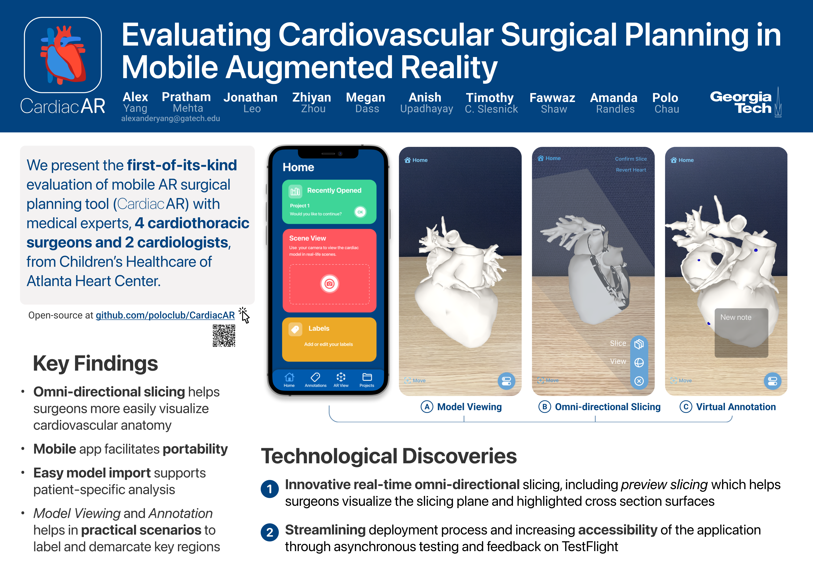

[](https://github.com/poloclub/CardiacAR/blob/main/LICENSE)
[](https://dl.acm.org/doi/10.1145/3429360.3468195)
[](https://arxiv.org/abs/2208.10639)

Augmented Reality based iOS application to help surgeons with cardiovascular surgical planning


<table>
  <tr>
    <td colspan="2"></td>
  </tr>
  <tr></tr>
  <tr>
    <td><a href="https://www.youtube.com/watch?v=VmAx7U18300">📺 Video</a></td>
    <td><a href="https://arxiv.org/abs/2208.10639">📖 Evaluating Cardiovascular Surgical Planning in Mobile Augmented Reality</a></td>
  </tr>
</table>

<!-- [**Live Demo** - Launch Argo Scholar in your browser](https://poloclub.github.io/argo-scholar/) -->
<!-- ## Documentations 


- [Quick Start (Visualization, Saving and Sharing Snapshots)](quickstart.md)
- [Tutorial - Visualizing a citation network of Apolo (Initialize Network, Incremental Exploration, Saving Progress)](tutorial.md)
- [Develop Argo Scholar](development.md)
- [Deploy Argo Scholar (and custom sharing service with access)](deploy.md) -->

## Feature Highlights

### Importing and Repositioning Model

Import your own custom heart models and reposition them in the physical space!


### Panning, Scaling, and Perspective View

Using CardiacAR, you can pan, rotate, and scale the model for better angles. You can also move your device through the model by moving it in the physical space to obtain a perspective view of the model.


### Model Slicing

Explore various cross sections of the model to beter understand the details of the heart model. Implement multiple slices and cross sections to narrow your field of view. Preview the slices before confirming them using the "Confirm Slice" button.


### Virtual Annotation


## Credits
♥ CardiacAR developers and collaborators: [Alex Yang](https://github.com/AlexanderHYang), [Pratham Mehta](https://github.com/twixupmysleeve), [Jonathan Leo](https://github.com/jpleo122), [Zhiyan Zhou](https://www.linkedin.com/in/zhiyan-zhou-b19515159/), [Megan Dass](http://megandass.me), [Anish Upadhayay](https://github.com/aupadhayay3), [Tim Slesnick](https://www.choa.org/doctors/timothy-c-slesnick), [Fawwaz Shaw](https://www.choa.org/doctors/fawwaz-ridwan-shaw), [Amanda Randles](https://bme.duke.edu/faculty/amanda-randles), and [Duen Horng Chau](https://faculty.cc.gatech.edu/~dchau/).
## Citation
Asian CHI 2021 Poster (System Design)
```bibTeX
@inproceedings{leo2021interactive,
  title={Interactive Cardiovascular Surgical Planning via Augmented Reality},
  author={Leo, Jonathan and Zhou, Zhiyan and Yang, Haoyang and Dass, Megan and Upadhayay, Anish and C Slesnick, Timothy and Shaw, Fawwaz and Horng Chau, Duen},
  booktitle={Asian CHI Symposium 2021},
  pages={132--135},
  year={2021}
}
```
VIS 2022 Poster (Evaluation)
```bibTeX
@article{Yang2022EvaluatingCS,
  title={Evaluating Cardiovascular Surgical Planning in Mobile Augmented Reality},
  author={H. Yang and Pratham Darrpan Mehta and Jonathan Leo and Zhiyan Zhou and Megan Dass and Anish Upadhayay and Timothy C. Slesnick and Fawwaz Shaw and Amanda Randles and Duen Horng Chau},
  journal={ArXiv},
  year={2022},
  volume={abs/2208.10639}
}
```

## License
CardiacAR is available under the  [MIT License](LICENSE).
CardiacAR uses the Euclid library, which is also licensed under the [MIT License](https://github.com/nicklockwood/Euclid/blob/master/LICENSE.md).


## Contact
If you have any questions or would like to contribute to the project, feel free to [open an issue](https://github.com/poloclub/CardiacAR/issues/new) or contact [Alex Yang](https://alexanderyang.me).
